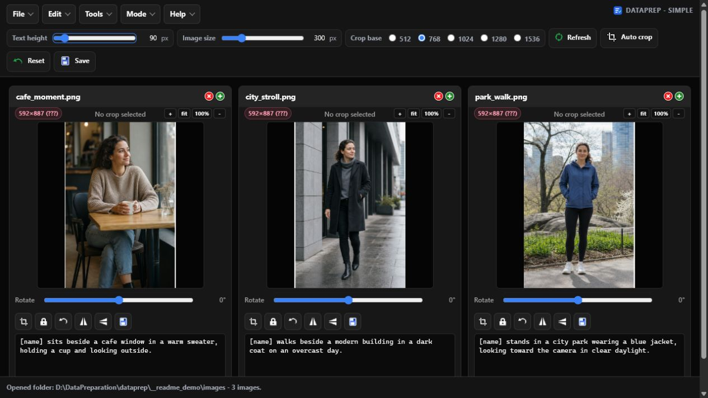
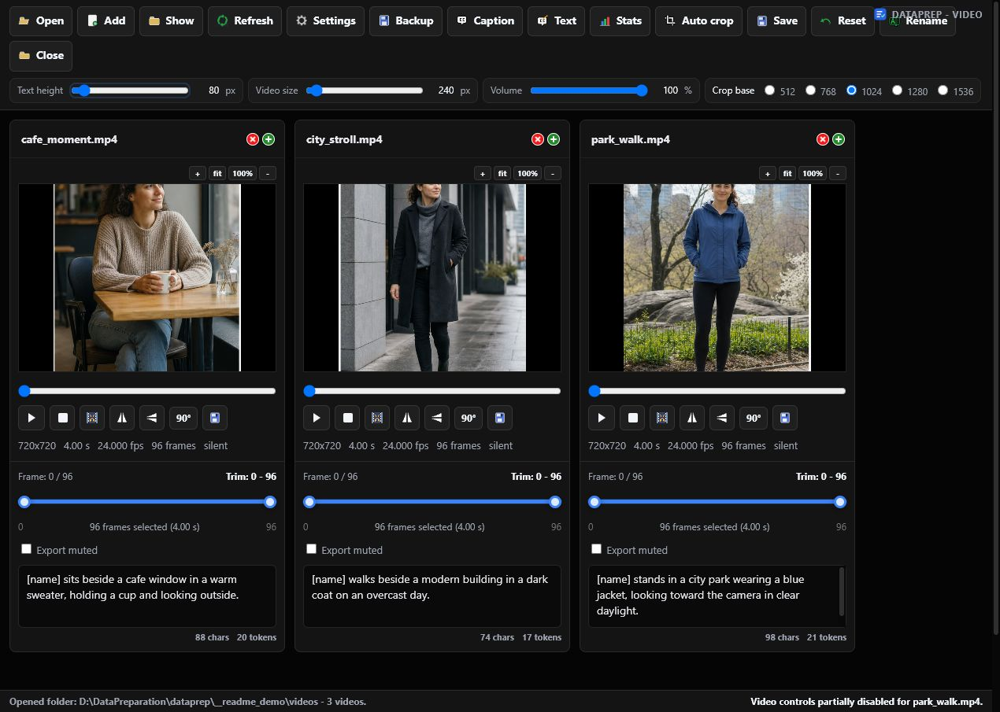

# DataPrep



DataPrep is a local dataset preparation tool for image and video captioning workflows. It runs as a Flask app on `127.0.0.1` and stores captions as `.txt` sidecar files next to the source media.

The app is designed for LoRA/dataset preparation work where files are edited directly in the dataset folder.

## Workflows

DataPrep has two workflows:

- **Images**: a direct image/caption card workflow with cropping, masking, captioning, categories, category groups, text tools, statistics, and batch actions.
- **Video**: video/caption cards with trimming, cropping, FPS conversion, slicing, statistics, visual captioning, and audio transcription.

## Repository Layout

```text
imageprep_simple.py   Image workflow
imageprep.py          Legacy workspace implementation
videoprep.py          Video mode
install.bat           Windows installer
install.sh            Linux installer
requirements.txt      Python dependency list
images/               UI icons and category icons
settings/             Runtime settings
models/               Downloaded or manually placed model files
tools/                Downloaded helper tools
wd14_models/          WD14 model cache
logs/                 Installer logs
BACKUPS/              App-created backups
```

Generated folders such as `.venv`, `models`, `wd14_models`, `BACKUPS`, `logs`, and Python caches should generally not be committed.

## Requirements

Recommended:

- Python 3.10-3.13
- FFmpeg and FFprobe on `PATH` for video tools
- Git for optional GitHub-based dependencies such as WhisperX
- Tkinter support for folder/file dialogs
- NVIDIA GPU with a current driver for local Qwen/Qwen3-VL and heavier captioning work

Linux package names vary by distribution. Common prerequisites include Python, venv support, Tkinter, Git, FFmpeg, curl, and build tooling.

On Windows, install Python with the `py` launcher enabled. Install FFmpeg separately if video conversion, slicing, or transcription is needed.

## Installation

### Windows

Run:

```bat
install.bat
```

The installer creates `.venv`, installs dependencies, selects a PyTorch build, downloads helper tools, writes default settings, and creates the Windows launchers `start.bat` and `start_video.bat`. It logs to:

```text
logs/install_log.txt
```

### Linux

Make the installer executable if needed:

```bash
chmod +x install.sh
```

Run:

```bash
./install.sh
```

The Linux installer creates `.venv`, installs dependencies, selects a PyTorch build, creates the executable launchers `start.sh` and `start_video.sh`, and writes logs to `logs/install_log.txt`.

Launcher files are generated by the installer for the current operating system and are not included in the repository before installation.

## Starting

### Windows

Images:

```bat
start.bat
```

Video:

```bat
start_video.bat
```

### Linux

Images:

```bash
./start.sh
```

Video:

```bash
./start_video.sh
```

Default local URLs:

- Images: `http://127.0.0.1:5000/`
- Video: `http://127.0.0.1:5002/`

## Basic Workflow

1. Start the app.
2. Open a dataset folder.
3. Add or refresh images/videos if needed.
4. Edit captions, crop settings, masks, or video settings.
5. Save individual cards or use toolbar batch actions.

Caption files use the same stem as the media file:

```text
example.png
example.txt
example.mp4
example.txt
```

## Image Workflows

Image modes support:

- image/caption card editing
- crop and resize tools
- flip controls
- zoom controls
- mask editing
- automatic mask generation with REMBG models
- manual watermark removal with LaMa or fast OpenCV inpainting
- caption backends such as JoyCaption, WD14, and Qwen3-VL
- text tools
- statistics
- batch rename, save, reset, convert, backup, and refresh actions

Using lossless PNG files is recommended for image preparation. Repeatedly saving images in lossy formats, such as JPEG or lossy WebP/AVIF, can accumulate compression artifacts and reduce image quality further. When non-PNG images are imported by paste or drag-and-drop, the app can convert them to uncompressed PNG.

### Categories and statistics

The image workflow keeps all image and caption cards in one view. Open **Tools > Stats** to see resolution, aspect-ratio, category-group, and category distributions. Use **Categorize images** in Statistics to create and edit category groups and categories, filter the dataset, and assign every image to a category. Newly added images initially use `Undefined`.

Category layouts can be saved as presets and restored with **Load**. User-created presets can be overwritten or deleted; the built-in `character` preset cannot be overwritten or deleted. To remove several category groups or categories at once, hold **Ctrl** while clicking them and press **Delete**. Deleted categories move their images to `Undefined`, while categories belonging to a deleted group move to `Uncategorized` unless those categories were also selected for deletion.

The Categorize images window can also use a local Qwen3-VL model or the External API configuration from Auto-caption to suggest categories automatically. Run it for all images or only `Undefined`, review the proposed category and confidence for each image, then apply the selected suggestions.

### Text tools

Text tools apply batch caption changes to the cards without immediately writing files. Use the card **Save** button or **Save all** to write accepted changes. **Undo** and **Reset** discard unsaved Text tools changes.

### Ideogram 4 JSON captions

Open **Tools > JSON captions** to edit Ideogram 4 caption sidecars with structured fields for the high-level description, style, background, object elements, and text elements. Elements can be added or removed independently. The separate **BBOXes** section adds, removes, and edits each element's normalized `[y_min, x_min, y_max, x_max]` coordinates in the range 0–1000; boxes can also be moved and resized directly over the image preview. **Raw JSON** remains available for advanced editing, and all views stay synchronized until the caption is validated and saved.

Ideogram JSON caption generation is deterministic with temperature `0`. Its visible **Max tokens** value is respected directly and defaults to `768`; it is no longer silently increased during generation. The captioning log reports image preparation time, model-input preparation time, generation time, generated token count, and token rate.

## Masks

Mask files are stored in a `mask` subfolder using matching image names:

```text
dataset/
  image0001.png
  image0001.txt
  mask/
    image0001.png
```

Masking mode supports brush, fill, right-button erase behavior, undo/redo history, mask opacity, automatic mask creation, mask expansion, and feathering.

Automatic masking uses REMBG where available. Model files may be downloaded on first use.

## Watermark Removal

The image workflow provides **Tools > Remove watermark**. Enable the watermark editor, paint over the unwanted watermark with the existing Brush or Fill tools, and press the watermark removal button on the card. The generated result remains an unsaved preview until the card or toolbar **Save** button is used.

Batch removal analyzes each image separately with Qwen3-VL, so watermark position and appearance may differ between images. A manually painted watermark mask takes priority for its image. Images without a sufficiently confident detection are skipped, and successful results remain unsaved previews until they are accepted with a card **Save** button or **Save all**.

The watermark removal mask is temporary and is kept separate from the training masks in the dataset's `mask` folder. Available backends are:

- **LaMa**: recommended for larger logos, text, and textured backgrounds. The approximately 196 MB model is downloaded to the local PyTorch cache on first use.
- **OpenCV Telea**: fast CPU processing for small marks and simple backgrounds.
- **OpenCV Navier-Stokes**: an alternative fast CPU method.

Use watermark removal only on images that you own or have permission to modify.



## Video Workflow

Video mode supports:

- video/caption card editing
- crop and trim
- FPS conversion, limited to lowering FPS
- audio removal without unnecessary video recompression when possible
- slicing videos into kept segments
- sortable statistics for length and resolution
- Qwen3-VL visual video captions
- WhisperX audio transcription
- text tools
- batch save, delete, clone, refresh, and backup actions

Slices are saved using names like:

```text
original_slice001.mp4
original_slice001.txt
original_slice002.mp4
original_slice002.txt
```

If a target filename already exists, the app adds a numeric suffix.

## Captioning Models

The installer does not download every model weight up front. Some models are downloaded the first time they are selected and run.

Large local vision-language models can require substantial VRAM. If captioning is slow or runs out of CUDA memory, reduce frame count, image/video max side, max tokens, or choose a smaller model.

Qwen3-VL and External API system prompts have separate preset lists in Auto-caption. Use Load, Save, and Delete beside the prompt field to manage them. The built-in `Simple character caption` preset cannot be overwritten or deleted; the Qwen3-VL version also instructs the model not to mention hair or eye color.

WhisperX is optional. If it or one of its dependencies is missing, only the WhisperX backend is unavailable; the rest of the app remains usable.

## Backup and Safety

Use the built-in Backup action before large batch operations.

DataPrep edits files in place. Operations such as rename, delete, crop save, trim save, FPS conversion, slicing, mask save, and batch conversion can modify or replace media files. Test new workflows on a small folder before applying them to a full dataset.

## Troubleshooting

If startup fails after updating the project:

1. Run the installer again.
2. Allow it to recreate `.venv` if prompted.
3. Check `logs/install_log.txt`.

Check FFmpeg:

```bash
ffmpeg -version
ffprobe -version
```

Check CUDA from inside the virtual environment:

```bash
python -c "import torch; print(torch.__version__); print(torch.version.cuda); print(torch.cuda.is_available())"
```

Use the project virtual environment Python for accurate checks:

```bat
.venv\Scripts\python.exe -c "import torch; print(torch.cuda.is_available())"
```

```bash
.venv/bin/python -c "import torch; print(torch.cuda.is_available())"
```

Run the release smoke tests from the project root:

```bat
.venv\Scripts\python.exe -m unittest discover -s tests -v
```

The smoke suite renders the image and video interfaces, checks their embedded JavaScript when Node.js is available, and verifies the system prompt preset lifecycle and built-in preset protection.

If Tkinter is missing on Linux, install the Tk bindings for your distribution's Python package. Common package names include `python3-tk`, `python3-tkinter`, `python-tkinter`, and `tk`.

## Development Notes

This is a local desktop-style web app. The Flask development server warning is expected for localhost use. Do not expose the server to untrusted networks.

Before committing, check the intended changed files:

```bash
git status
git diff --stat
```

Avoid committing generated runtime artifacts such as `.venv`, downloaded models, backups, logs, and caches.

## License

DataPrep is licensed under the [MIT License](LICENSE).

Copyright (c) 2026 mattpeterstead. Third-party libraries, models, and assets remain subject to their respective licenses.
